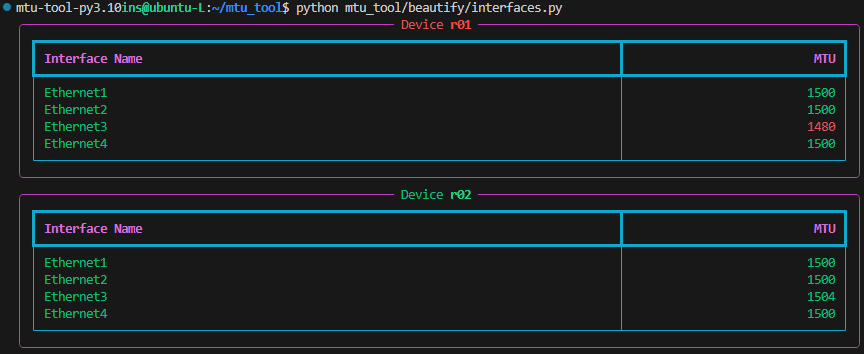
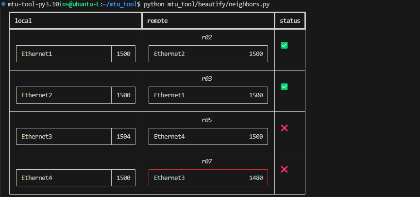
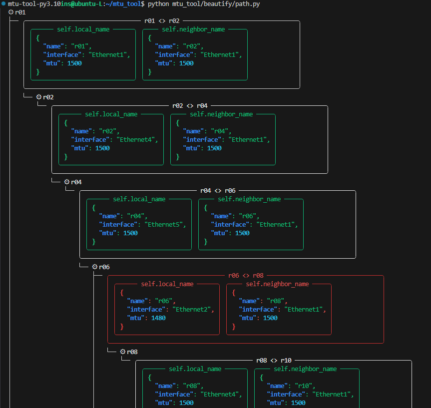

Rich makes it easy to generate appealing console output, allowing you to format and colorize text with ease. In the `beautify` folder, you'll find three prepared tasks, and your goal is to visualize them using Rich. Feel free to get creative and experiment with colors you might not normally use — it's all for educational purposes!


## Beautify

### Interfaces `mtu_tool/beautify/interfaces.py`

The data to be displayed is a dictionary where the keys are hostnames and the values are lists of `InterfaceItem` objects. The `InterfaceItem` dataclass, located in `mtu_tool.models.itms`, defines the structure for the interface data. If a `min_mtu` value is provided, it should be easy to identify any MTU values that are lower than the specified minimum.

```python
from typing import Dict, List

from rich.console import Console

from mtu_tool.models.itms import InterfaceItem


def print_interfaces(
    data: Dict["str", List[InterfaceItem]],
    min_mtu: int = None,
    console: Console = Console(),
):

    # TODO
    # use console.print(...) to print


if __name__ == "__main__":
    demo_data = {
        "r01": [
            InterfaceItem("Ethernet1", 1500),
            InterfaceItem("Ethernet2", 1500),
            InterfaceItem("Ethernet3", 1480),
            InterfaceItem("Ethernet4", 1500),
        ],
        "r02": [
            InterfaceItem("Ethernet1", 1500),
            InterfaceItem("Ethernet2", 1500),
            InterfaceItem("Ethernet3", 1504),
            InterfaceItem("Ethernet4", 1500),
        ],
    }
    print_interfaces(demo_data, min_mtu=1500)
```

??? tip "Need inspiration?"

    


??? example "One possible solution"

    ```python
    from typing import Dict, List

    from rich.console import Console
    from rich.panel import Panel
    from rich.table import Table

    from mtu_tool.models.itms import InterfaceItem


    def _mtu_rich_str(mtu: int, min_mtu: int = None) -> str:
        if not min_mtu:
            return str(mtu)
        return str(mtu) if mtu >= min_mtu else f"[red]{mtu}[/red]"


    def print_interfaces(
        data: Dict["str", List[InterfaceItem]],
        min_mtu: int = None,
        console: Console = Console(),
    ):
        for host, interface_list in data.items():
            table = Table(style="cyan", row_styles=["green"], expand=True)
            table.add_column("Interface Name")
            table.add_column("MTU", justify="right")

            for item in interface_list:
                table.add_row(item.name, _mtu_rich_str(mtu=item.mtu, min_mtu=min_mtu))

            title_colour = (
                "red"
                if min_mtu and min([x.mtu for x in interface_list]) < min_mtu
                else "green"
            )
            console.print(
                Panel(table, title=f"[{title_colour}]Device [b]{host}[/b]", style="magenta")
            )


    if __name__ == "__main__":
        demo_data = {
            "r01": [
                InterfaceItem("Ethernet1", 1500),
                InterfaceItem("Ethernet2", 1500),
                InterfaceItem("Ethernet3", 1480),
                InterfaceItem("Ethernet4", 1500),
            ],
            "r02": [
                InterfaceItem("Ethernet1", 1500),
                InterfaceItem("Ethernet2", 1500),
                InterfaceItem("Ethernet3", 1504),
                InterfaceItem("Ethernet4", 1500),
            ],
        }
        print_interfaces(demo_data, min_mtu=1500)
    ```


### Neighbors `mtu_tool/beautify/neighbors.py`

Display the connection details for each link between the LLDP neighbors. The `print_neighbors` function accepts a list of `ConnectionItem` objects. It is highly recommended to use a different style than the one used in the previous task for a better learning effect.

```python
from typing import List

from rich.console import Console

from mtu_tool.models.itms import ConnectionItem


def print_neighbors(
    connections: List[ConnectionItem],
    min_mtu: int = None,
    console: Console = Console(),
):

    # TODO
    # use console.print(...) to print


if __name__ == "__main__":
    demo_data = [
        ConnectionItem(
            local_interface="Ethernet1",
            local_mtu=1500,
            neighbor_name="r02",
            neighbor_interface="Ethernet2",
            neighbor_mtu=1500,
        ),
        ConnectionItem(
            local_interface="Ethernet2",
            local_mtu=1500,
            neighbor_name="r03",
            neighbor_interface="Ethernet1",
            neighbor_mtu=1500,
        ),
        ConnectionItem(
            local_interface="Ethernet3",
            local_mtu=1504,
            neighbor_name="r05",
            neighbor_interface="Ethernet4",
            neighbor_mtu=1500,
        ),
        ConnectionItem(
            local_interface="Ethernet4",
            local_mtu=1500,
            neighbor_name="r07",
            neighbor_interface="Ethernet3",
            neighbor_mtu=1480,
        ),
    ]
    print_neighbors(demo_data, min_mtu=1500)
```

??? tip "Need inspiration?"

    


??? example "One possible solution"

    ```python
    from typing import List

    from rich.console import Console
    from rich.panel import Panel
    from rich.table import Table

    from mtu_tool.models.itms import ConnectionItem


    def print_neighbors(
        connections: List[ConnectionItem],
        min_mtu: int = None,
        console: Console = Console(),
    ):
        site_table = Table(show_lines=True)
        site_table.add_column("local", vertical="bottom")
        site_table.add_column("remote")
        site_table.add_column("status", vertical="middle")

        for item in connections:
            local_table = Table(show_header=False)
            local_table.add_column("Interface", min_width=25)
            local_table.add_column("MTU")
            if min_mtu and item.local_mtu < min_mtu:
                local_table.style = "red"

            remote_table = Table(show_header=False, title=item.neighbor_name)
            remote_table.add_column("Interface", min_width=25)
            remote_table.add_column("MTU")
            if min_mtu and item.neighbor_mtu < min_mtu:
                remote_table.style = "red"

            local_table.add_row(item.local_interface, str(item.local_mtu))
            remote_table.add_row(item.neighbor_interface, str(item.neighbor_mtu))

            status_str = (
                ":white_heavy_check_mark:"
                if item.local_mtu == item.neighbor_mtu
                else ":cross_mark:"
            )
            site_table.add_row(local_table, remote_table, status_str)

        console.print(site_table)


    if __name__ == "__main__":
        demo_data = [
            ConnectionItem(
                local_interface="Ethernet1",
                local_mtu=1500,
                neighbor_name="r02",
                neighbor_interface="Ethernet2",
                neighbor_mtu=1500,
            ),
            ConnectionItem(
                local_interface="Ethernet2",
                local_mtu=1500,
                neighbor_name="r03",
                neighbor_interface="Ethernet1",
                neighbor_mtu=1500,
            ),
            ConnectionItem(
                local_interface="Ethernet3",
                local_mtu=1504,
                neighbor_name="r05",
                neighbor_interface="Ethernet4",
                neighbor_mtu=1500,
            ),
            ConnectionItem(
                local_interface="Ethernet4",
                local_mtu=1500,
                neighbor_name="r07",
                neighbor_interface="Ethernet3",
                neighbor_mtu=1480,
            ),
        ]
        print_neighbors(demo_data, min_mtu=1500)

    ```

### Path `mtu_tool/beautify/path.py`

The task is to visualize multiple paths, with each path representing hop-by-hop information stored as `ConnectionItem` objects. There are many ways to achieve this, so feel free to get creative. Don't be afraid to experiment with approaches you might not normally consider.

```python
from typing import List

from rich.console import Console

from mtu_tool.models.itms import ConnectionItem


def print_path(
    paths: List[List[ConnectionItem]],
    start_name: str,
    min_mtu: int = None,
    console: Console = Console(),
):

    # ToDo
    # use console.print(...) to print


if __name__ == "__main__":
    demo_paths = [
        [
            ConnectionItem(
                local_name="r01",
                local_interface="Ethernet1",
                local_mtu=1500,
                neighbor_name="r02",
                neighbor_interface="Ethernet1",
                neighbor_mtu=1500,
            ),
            ConnectionItem(
                local_name="r02",
                local_interface="Ethernet4",
                local_mtu=1500,
                neighbor_name="r04",
                neighbor_interface="Ethernet1",
                neighbor_mtu=1500,
            ),
            ConnectionItem(
                local_name="r04",
                local_interface="Ethernet5",
                local_mtu=1500,
                neighbor_name="r06",
                neighbor_interface="Ethernet1",
                neighbor_mtu=1500,
            ),
            ConnectionItem(
                local_name="r06",
                local_interface="Ethernet2",
                local_mtu=1480,
                neighbor_name="r08",
                neighbor_interface="Ethernet1",
                neighbor_mtu=1500,
            ),
            ConnectionItem(
                local_name="r08",
                local_interface="Ethernet4",
                local_mtu=1500,
                neighbor_name="r10",
                neighbor_interface="Ethernet1",
                neighbor_mtu=1500,
            ),
        ],
        [
            ConnectionItem(
                local_name="r01",
                local_interface="Ethernet1",
                local_mtu=1500,
                neighbor_name="r02",
                neighbor_interface="Ethernet1",
                neighbor_mtu=1500,
            ),
            ConnectionItem(
                local_name="r02",
                local_interface="Ethernet4",
                local_mtu=1500,
                neighbor_name="r04",
                neighbor_interface="Ethernet1",
                neighbor_mtu=1500,
            ),
            ConnectionItem(
                local_name="r04",
                local_interface="Ethernet5",
                local_mtu=1500,
                neighbor_name="r06",
                neighbor_interface="Ethernet1",
                neighbor_mtu=1500,
            ),
            ConnectionItem(
                local_name="r06",
                local_interface="Ethernet3",
                local_mtu=1500,
                neighbor_name="r09",
                neighbor_interface="Ethernet1",
                neighbor_mtu=1500,
            ),
            ConnectionItem(
                local_name="r09",
                local_interface="Ethernet4",
                local_mtu=1500,
                neighbor_name="r10",
                neighbor_interface="Ethernet2",
                neighbor_mtu=1500,
            ),
        ],
        [
            ConnectionItem(
                local_name="r01",
                local_interface="Ethernet1",
                local_mtu=1500,
                neighbor_name="r03",
                neighbor_interface="Ethernet1",
                neighbor_mtu=1500,
            ),
            ConnectionItem(
                local_name="r03",
                local_interface="Ethernet4",
                local_mtu=1500,
                neighbor_name="r05",
                neighbor_interface="Ethernet1",
                neighbor_mtu=1480,
            ),
            ConnectionItem(
                local_name="r05",
                local_interface="Ethernet5",
                local_mtu=1500,
                neighbor_name="r07",
                neighbor_interface="Ethernet1",
                neighbor_mtu=1500,
            ),
            ConnectionItem(
                local_name="r07",
                local_interface="Ethernet3",
                local_mtu=1480,
                neighbor_name="r09",
                neighbor_interface="Ethernet2",
                neighbor_mtu=1480,
            ),
            ConnectionItem(
                local_name="r09",
                local_interface="Ethernet4",
                local_mtu=1500,
                neighbor_name="r10",
                neighbor_interface="Ethernet2",
                neighbor_mtu=1500,
            ),
        ],
    ]
    print_path(demo_paths, "r01", min_mtu=1500)

```

??? tip "Need inspiration?"

    


??? example "One possible solution"

    To simplify the code, the `ConnectionItem` class was extended by the method `__rich__(self)` to support the rich protocoll.

    ```python title="mtu_tool/models/itms.py"
    from rich.columns import Columns
    from rich.panel import Panel
    from rich.json import JSON

    @dataclass
    class ConnectionItem:
        local_interface: str
        local_mtu: int
        neighbor_name: str
        neighbor_interface: str
        local_name: str = None
        neighbor_mtu: int = None

        def __rich__(self) -> Panel:
            colour = "red" if self.local_mtu != self.neighbor_mtu else "green"
            text = Columns(
                [
                    Panel(
                        JSON.from_data(
                            {
                                "name": self.local_name,
                                "interface": self.local_interface,
                                "mtu": self.local_mtu,
                            }
                        ),
                        title=f"[{colour}]self.local_name",
                        style=colour,
                    ),
                    Panel(
                        JSON.from_data(
                            {
                                "name": self.neighbor_name,
                                "interface": self.neighbor_interface,
                                "mtu": self.neighbor_mtu,
                            }
                        ),
                        title=f"[{colour}]self.neighbor_name",
                        style=colour,
                    ),
                ]
            )
            return Panel(text, title=f"{self.local_name} <> {self.neighbor_name}", width=80)
    ``` 

    ```python title="mtu_tool/beautify/path.py"
    from typing import List

    from rich.console import Console
    from rich.tree import Tree

    from mtu_tool.models.itms import ConnectionItem


    def print_path(
        paths: List[List[ConnectionItem]],
        start_name: str,
        min_mtu: int = None,
        console: Console = Console(),
    ):

        tree = Tree(f":gear: {start_name}")
        devices = {}
        for path in paths:
            sub_tree = tree
            for step in path:
                find_in_tree = filter(lambda x: x.label == step, sub_tree.children)
                if existing_tree := next(find_in_tree, None):
                    sub_tree = existing_tree.children[0]
                    continue
                sub_tree = sub_tree.add(
                    step,
                    highlight=True,
                    style=(
                        "red"
                        if min_mtu
                        and (step.local_mtu < min_mtu or min_mtu > step.neighbor_mtu)
                        else None
                    ),
                ).add(f":gear: {step.neighbor_name}", style="white")
        console.print(tree)


    if __name__ == "__main__":
        demo_paths = [
            [
                ConnectionItem(
                    local_name="r01",
                    local_interface="Ethernet1",
                    local_mtu=1500,
                    neighbor_name="r02",
                    neighbor_interface="Ethernet1",
                    neighbor_mtu=1500,
                ),
                ConnectionItem(
                    local_name="r02",
                    local_interface="Ethernet4",
                    local_mtu=1500,
                    neighbor_name="r04",
                    neighbor_interface="Ethernet1",
                    neighbor_mtu=1500,
                ),
                ConnectionItem(
                    local_name="r04",
                    local_interface="Ethernet5",
                    local_mtu=1500,
                    neighbor_name="r06",
                    neighbor_interface="Ethernet1",
                    neighbor_mtu=1500,
                ),
                ConnectionItem(
                    local_name="r06",
                    local_interface="Ethernet2",
                    local_mtu=1480,
                    neighbor_name="r08",
                    neighbor_interface="Ethernet1",
                    neighbor_mtu=1500,
                ),
                ConnectionItem(
                    local_name="r08",
                    local_interface="Ethernet4",
                    local_mtu=1500,
                    neighbor_name="r10",
                    neighbor_interface="Ethernet1",
                    neighbor_mtu=1500,
                ),
            ],
            [
                ConnectionItem(
                    local_name="r01",
                    local_interface="Ethernet1",
                    local_mtu=1500,
                    neighbor_name="r02",
                    neighbor_interface="Ethernet1",
                    neighbor_mtu=1500,
                ),
                ConnectionItem(
                    local_name="r02",
                    local_interface="Ethernet4",
                    local_mtu=1500,
                    neighbor_name="r04",
                    neighbor_interface="Ethernet1",
                    neighbor_mtu=1500,
                ),
                ConnectionItem(
                    local_name="r04",
                    local_interface="Ethernet5",
                    local_mtu=1500,
                    neighbor_name="r06",
                    neighbor_interface="Ethernet1",
                    neighbor_mtu=1500,
                ),
                ConnectionItem(
                    local_name="r06",
                    local_interface="Ethernet3",
                    local_mtu=1500,
                    neighbor_name="r09",
                    neighbor_interface="Ethernet1",
                    neighbor_mtu=1500,
                ),
                ConnectionItem(
                    local_name="r09",
                    local_interface="Ethernet4",
                    local_mtu=1500,
                    neighbor_name="r10",
                    neighbor_interface="Ethernet2",
                    neighbor_mtu=1500,
                ),
            ],
            [
                ConnectionItem(
                    local_name="r01",
                    local_interface="Ethernet1",
                    local_mtu=1500,
                    neighbor_name="r03",
                    neighbor_interface="Ethernet1",
                    neighbor_mtu=1500,
                ),
                ConnectionItem(
                    local_name="r03",
                    local_interface="Ethernet4",
                    local_mtu=1500,
                    neighbor_name="r05",
                    neighbor_interface="Ethernet1",
                    neighbor_mtu=1480,
                ),
                ConnectionItem(
                    local_name="r05",
                    local_interface="Ethernet5",
                    local_mtu=1500,
                    neighbor_name="r07",
                    neighbor_interface="Ethernet1",
                    neighbor_mtu=1500,
                ),
                ConnectionItem(
                    local_name="r07",
                    local_interface="Ethernet3",
                    local_mtu=1480,
                    neighbor_name="r09",
                    neighbor_interface="Ethernet2",
                    neighbor_mtu=1480,
                ),
                ConnectionItem(
                    local_name="r09",
                    local_interface="Ethernet4",
                    local_mtu=1500,
                    neighbor_name="r10",
                    neighbor_interface="Ethernet2",
                    neighbor_mtu=1500,
                ),
            ],
        ]
        print_path(demo_paths, "r01", min_mtu=1500)

    ```

## Links:

- [Rich](https://rich.readthedocs.io/)
