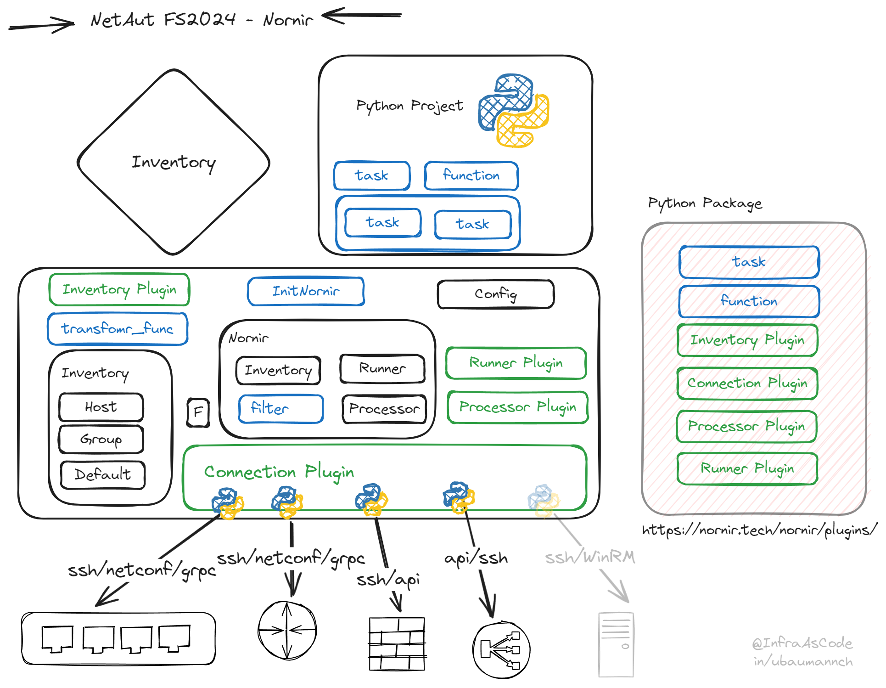

> Pluggable multi-threaded framework with inventory management to help operate collections of devices

Nornir is a powerful framework, and since version 3, it provides only core functionality. All additional features are now available through separate plugins.

## Links:

- [Nornir Docs](https://nornir.readthedocs.io/)
- [Nornir Plugis](https://nornir.tech/nornir/plugins/)