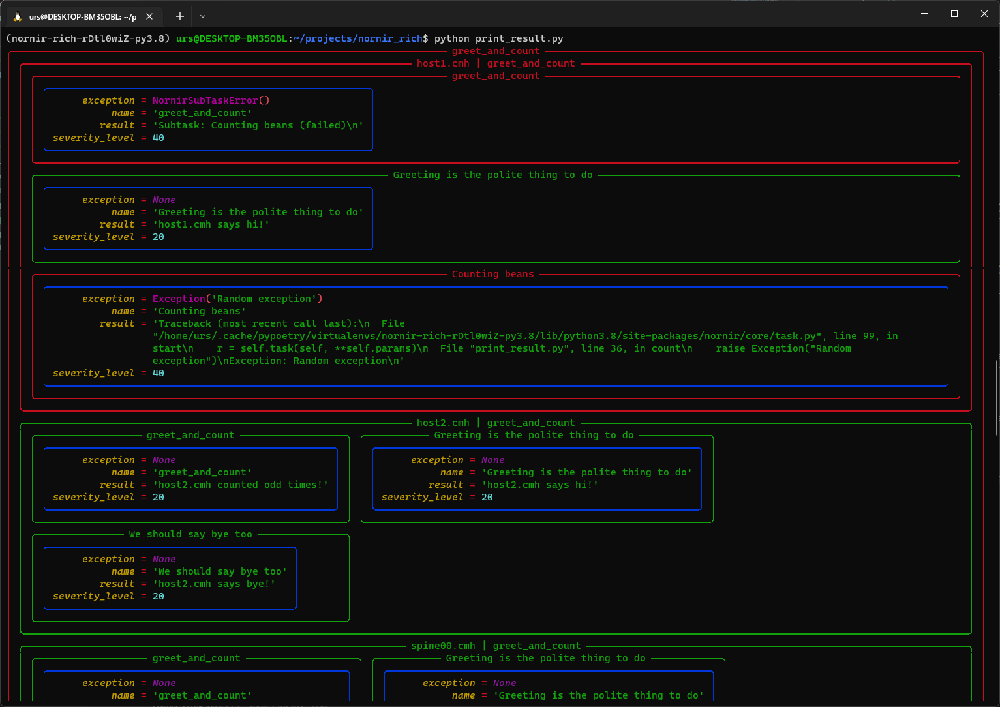
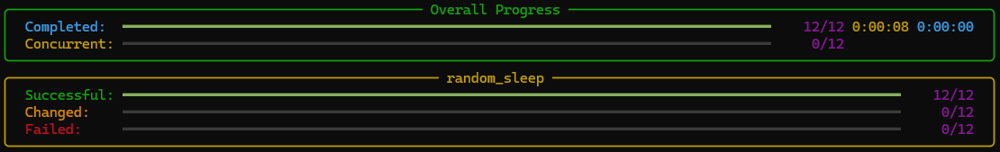

Rich enables beautifully formatted output in text terminals, offering features like tables, syntax-highlighted code, and Markdown support.

When working with Nornir, the [nornir-rich plugin](https://github.com/InfrastructureAsCode-ch/nornir_rich/blob/develop/docs/imgs/progressbar.png) has some features to leaveraging rich. However, you always can use rich direct in your scripts.


## print_result

```python
from nornir_rich.functions import print_result

results = nr.run(
    task=hello_world
)

print_result(results)
print_result(results, vars=["diff", "result", "name", "exception", "severity_level"])

```




## RichProgressBar

```python
from time import sleep
from nornir_rich.progress_bar import RichProgressBar


def random_sleep(task: Task) -> Result:
    delay = randrange(10)
    sleep(delay)
    return Result(host=task.host, result=f"{delay} seconds delay")


nr_with_processors = nr.with_processors([RichProgressBar()])
result = nr_with_processors.run(task=random_sleep)
```



Links:

- [Rich](https://rich.readthedocs.io/)
- [Textual TUI](https://textual.textualize.io/)
- [posting (TUI Example)](https://posting.sh/)
