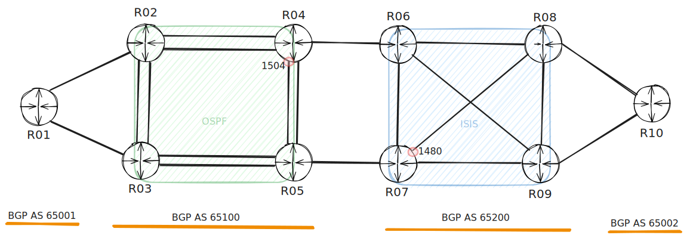
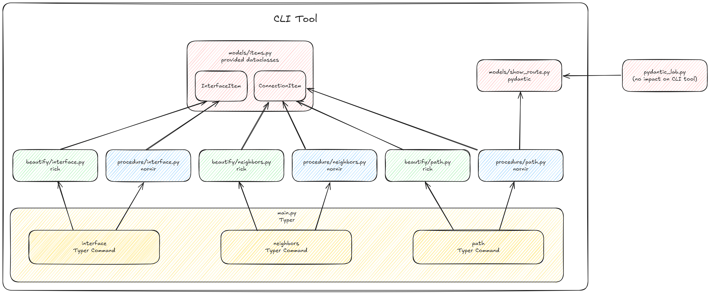

The workshop is designed around a use case where you are tasked with building a small CLI tool to interact with the network and extract the MTU (Maximum Transmission Unit) of various interfaces. The goal is to create a user-friendly tool that your coworkers can easily install and use.

Please note that this use case is intended for educational purposes only. There are other tools and solutions available that can accomplish the same task.

## Topology

## Commands

### Interfaces

Display the names of all network interfaces along with their MTU sizes. If no hostname is specified, the output will include all network devices in the inventory. If a minimum MTU value is provided, any interfaces with an MTU size below that threshold will be highlighted in red in the output.

### Neighbors

For a specific network device, the LLDP neighbors are gathered, and for each connection, the interface names and their MTU sizes are displayed. If the MTU size does not match, it will be highlighted in red. Additionally, if a minimum MTU value is specified, any interfaces with an MTU size below that threshold will also be highlighted in red in the output.

### Path

For a given destination (specified as an IPv4 address in CIDR notation) and a starting network device, the path is discovered recursively. For each hop, the MTU is compared, and any mismatch is highlighted in red. If a minimum MTU value is specified, any MTU lower than this threshold will also be marked red in the output.

Although for a small number of devices it would be easier to collect the data in parallel from all hosts, the goal of this exercise is to demonstrate how complex workflows can also be implemented.

*Keep in mind that there is a high chance you may not complete this command within the workshop time.*

## Mocked Data

o avoid the need for setting up a lab with 10 routers, mocked data for the NAPALM Mock Driver is provided. The lab itself was created using Netlab and is also available if you'd like to work with a real lab setup.

The mocked data was collected with a simple CLI tool built using Nornir, NAPALM, and Typer. 😉

## Code

You can find the code here: [https://github.com/ubaumann/mtu_tool](https://github.com/ubaumann/mtu_tool)

The following graphic illustrates how the various exercises will ultimately come together to form a CLI tool.

